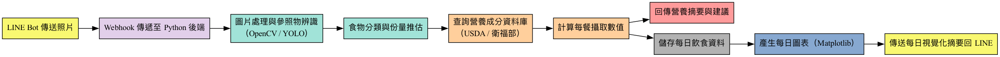

# SnapBite


English version available below — [Jump to English ⬇](#snapbite-en)  

SnapBite 是一個整合 LINE Bot 與 AI 圖像分析的飲食追蹤系統。使用者只需透過 LINE 傳送餐點照片，系統便能自動辨識食物、分析份量與營養成分，並提供即時建議與每日視覺化報告。


## 功能特色

- 圖像辨識：自動偵測食物與參照物
- 份量推估：使用電腦視覺分析食物比例
- 營養計算：結合資料庫精準估算熱量與營養素
- 飲食建議：根據攝取情況給出即時回饋
- 視覺化報告：每日生成飲食雷達圖與營養統計圖

##  技術架構

- **前端**：LINE Bot（部署於 Zeabur）
- **後端**：Python + Gradio，負責圖像處理與 API 回應
- **AI 模型**：YOLOv8 / OpenCV / 自訂分類器
- **資料來源**：USDA FoodData Central、台灣食物營養資料庫
- **視覺化**：Matplotlib / Plotly

## 專案結構

```
SnapBite/
├── source/
│   ├── DrawArch.py          # 系統流程圖產生器
│   ├── image_analysis.py    # 圖像辨識與尺寸估算
│   ├── nutrition.py         # 營養計算邏輯
│   ├── suggest.py           # 飲食建議生成模組
│   ├── visualize.py         # 視覺化每日飲食數據
│
├── linebot_app/
│   ├── webhook.py           # FastAPI Webhook（LINE 簽章驗證）
│   ├── handler.py           # 文字與圖片分析流程，呼叫 OpenAI 視覺模型
│   ├── reply_format.py      # 格式化回傳訊息（文字摘要）
│   └── storage.py           # SQLite 儲存分析結果
│
├── data/                    # 儲存使用者餐點與營養紀錄 / SQLite DB
└── README.md
```

## 快速開始

1. 安裝 Python 套件：
   ```bash
   pip install -r requirements.txt
   ```

2. 設定環境變數（可使用 `.env`）：
   ```bash
   OPENAI_API_KEY=<你的 OpenAI 金鑰>
   LINE_CHANNEL_ACCESS_TOKEN=<LINE 長期存取權杖>
   LINE_CHANNEL_SECRET=<LINE Channel Secret>
   SNAPBITE_DB_PATH=data/snapbite.db
   ```

3. 執行 Gradio 後端測試：
   ```bash
   python source/app.py
   ```

4. 啟動 LINE Webhook（FastAPI）：
   ```bash
   uvicorn linebot_app.webhook:app --host 0.0.0.0 --port 8000
   ```

5. 在 Zeabur 部署 webhook 並綁定 LINE Bot（Webhook URL 指向 `/callback`）

## 聯絡我們

由 Chun 開發，專為實用又溫暖的健康生活打造。

## Demo


add line friends

---

## SnapBite (EN)

SnapBite is a dietary tracking system that integrates LINE Bot with AI-powered image analysis. By simply sending a photo of your meal through LINE, the system can automatically detect food items, estimate portion sizes using reference objects, analyze nutritional content, and provide real-time dietary suggestions along with daily visual summaries.


## Features

- Image Recognition: Automatically detect food and reference objects
- Portion Estimation: Analyze portion size using computer vision
- Nutrition Calculation: Estimate calorie and nutrient intake using databases
- Dietary Advice: Provide instant feedback based on intake
- Visual Summary: Generate daily radar charts and nutrition graphs

## Technical Stack

- **Frontend**: LINE Bot (deployed via Zeabur)
- **Backend**: Python + Gradio for image processing and API responses
- **AI Models**: YOLOv8 / OpenCV / Custom classifier
- **Data Sources**: USDA FoodData Central, Taiwan Nutrition Database
- **Visualization**: Matplotlib / Plotly

## Project Structure

```
SnapBite/
├── source/
│   ├── DrawArch.py          # Architecture diagram generator
│   ├── image_analysis.py    # Image recognition and size estimation
│   ├── nutrition.py         # Nutrition calculation logic
│   ├── suggest.py           # Dietary suggestion module
│   ├── visualize.py         # Daily nutrition visualization
│
├── linebot_app/
│   ├── webhook.py           # FastAPI Webhook entry (LINE signature verification)
│   ├── handler.py           # Text and image processing with OpenAI vision
│   ├── reply_format.py      # Format LINE responses (text summary)
│   └── storage.py           # SQLite persistence for analyses
│
├── data/                    # User meal and nutrition records / SQLite DB
└── README.md
```

## Getting Started

1. Install Python dependencies:
   ```bash
   pip install -r requirements.txt
   ```

2. Set environment variables (or use `.env`):
   ```bash
   OPENAI_API_KEY=<your OpenAI key>
   LINE_CHANNEL_ACCESS_TOKEN=<LINE channel access token>
   LINE_CHANNEL_SECRET=<LINE channel secret>
   SNAPBITE_DB_PATH=data/snapbite.db
   ```

3. Run the Gradio backend for testing:
   ```bash
   python source/app.py
   ```

4. Start the LINE webhook (FastAPI):
   ```bash
   uvicorn linebot_app.webhook:app --host 0.0.0.0 --port 8000
   ```

5. Deploy the webhook on Zeabur and bind it to your LINE Bot (Webhook URL points to `/callback`)

## Contact

Developed by Chun — built for a smart and caring approach to everyday health.
